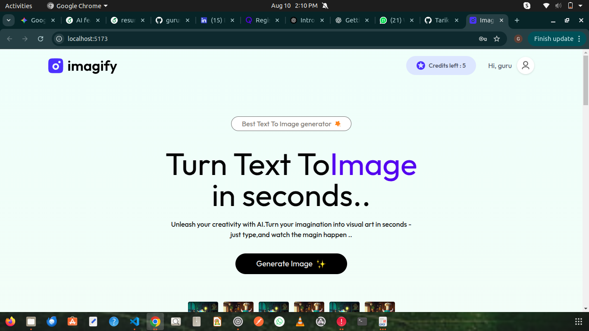
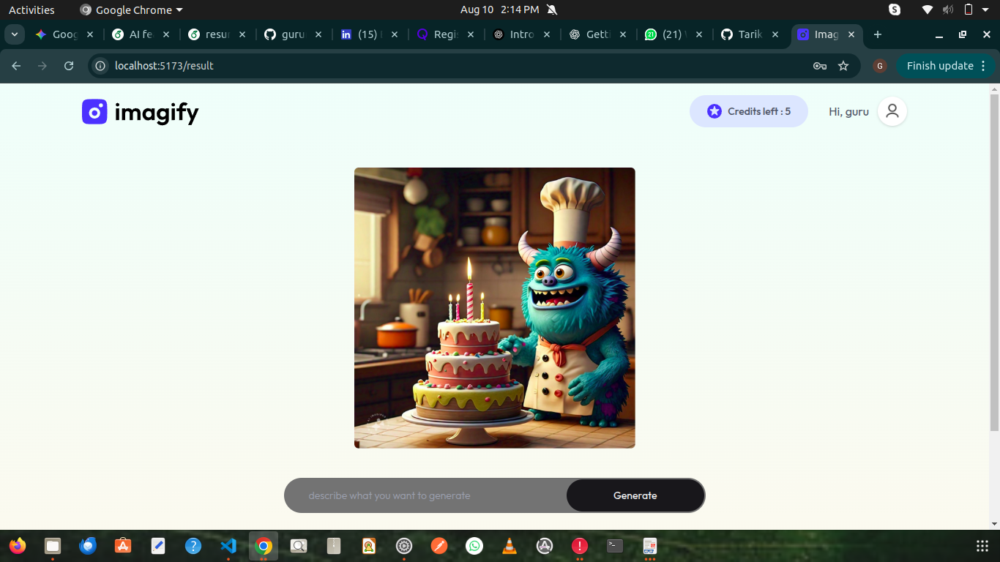
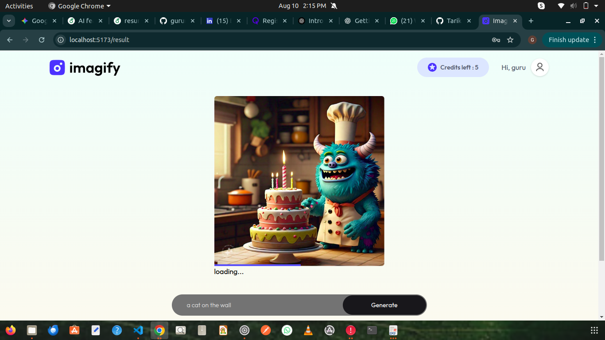
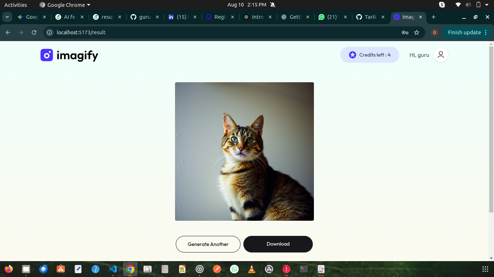

# Imagify – AI-Powered Text-to-Image Generator

Imagify is a full-stack MERN application that allows users to generate AI-powered images from text prompts using the [ClipDrop API](https://clipdrop.co/apis). It includes secure user authentication, a credit-based system for image generation, and payment integration using Stripe.

---

## 🚀 Features
- **User Authentication** – Sign up, login, and secure session handling using JWT.
- **AI Image Generation** – Generate high-quality images from text prompts via ClipDrop API.
- **Credit-Based System** – Each image generation consumes credits.
- **Stripe Payment Integration** – Purchase credits for generating more images.
- **Responsive UI** – Built with React.js and Tailwind CSS for smooth user experience.
- **MongoDB Data Storage** – Store user details, transactions, and generated image history.

---

## 🛠 Tech Stack
**Frontend:**
- React.js
- Tailwind CSS
- Axios

**Backend:**
- Node.js
- Express.js
- MongoDB
- JWT for authentication

**APIs & Services:**
- ClipDrop API – AI image generation
- Stripe API – Payments

---


---

## ⚙️ Installation & Setup

### 1️⃣ Clone the Repository
```bash
git clone https://github.com/guruneela385/imagify.git
cd imagify

Install Dependencies
Frontend:
cd client
npm install

Backend:
cd ../server
npm install


Set Environment Variables
Create a .env file in the server folder and add:
MONGO_URI=your_mongodb_connection_string
JWT_SECRET=your_secret_key
CLIPDROP_API_KEY=your_clipdrop_api_key
STRIPE_SECRET_KEY=your_stripe_secret_key

Run the Application

Backend:
cd server
npm start

Frontend:
cd client
npm run dev


## 📸 Screenshots

## 📸 Screenshots

### 🏠 Home Page


### 💳 Pricing Page


### 🎨 Generation Example 1


### 🎨 Generation Example 2


### 🖼 Final Generated Image



